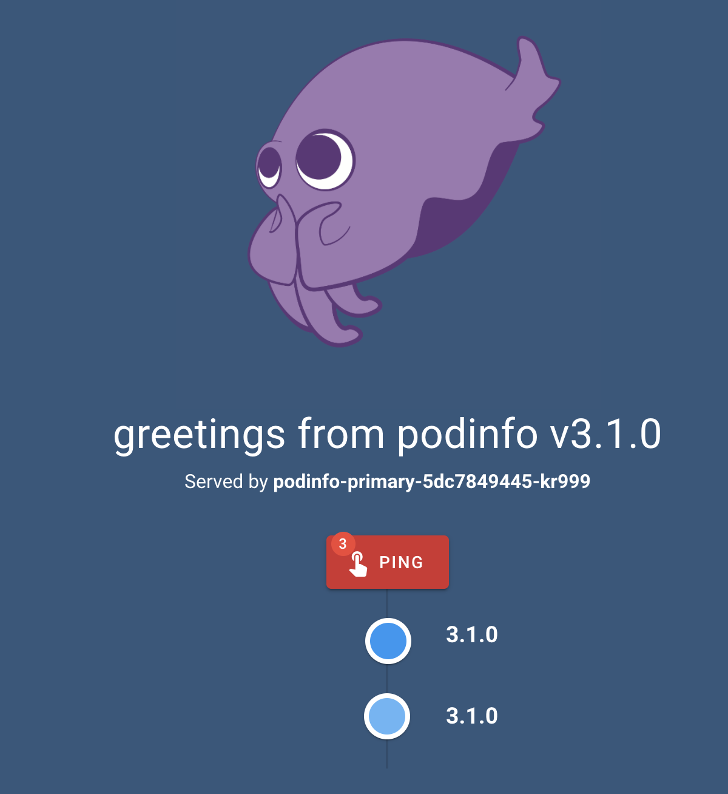

# appmesh

## Setup repo
This repo was setup using eksctl,
[git@github.com:seizadi/eksctl.git repo](https://github.com/seizadi/eksctl),
was used to create , see
[it using Weaveworks eksctl](https://eks.handson.flagger.dev/profile/#create-a-github-repository).
This is created using:
```bash
make repo
make mesh
```
The project is a demo of Weaveworks partnership with AWS to deploy a Gitops native k8s deployment
pipeline. The manifests in ./base/appmesh-system and ./base/kube-system and ./flux would be
removed and will be part of cluster orchestration as the services deployed would be used by
all applications. The cluster services that are orchestrated by the manifest are:
   * Declare CRDs used by AWS AppMesh and Weaveworks Flux and Flagger
   * Deploy Flux system including Flux Controller, Helm Operator and Memcache
   * Deploy AppMesh system including AppMesh Controller, Grafana, Prometheus and Flagger
   * Deploy Prometheus server used as Metrics Server in the cluster

We use [kustomize](https://github.com/kubernetes-sigs/kustomize) to setup the project for the pipeline
deployment:
```bash
for dir in ./flux ./base; do
  ( pushd "$dir" && kustomize create --autodetect --recursive )
done
```
To complete the kustomize setup with setup the top level yaml:
```bash
cat << EOF | tee kustomization.yaml
apiVersion: kustomize.config.k8s.io/v1beta1
kind: Kustomization
bases:
  - base
  - flux
EOF
```
The cluster we crated in
[git@github.com:seizadi/eksctl.git repo](https://github.com/seizadi/eksctl),
has a Flux controller watching this repo and we need a flux.yaml for it to know how to build
the repo: 
```bash
cat << EOF | tee .flux.yaml
version: 1
commandUpdated:
  generators:
    - command: kustomize build .
EOF
```
Verify kustomize is working before commit
```bash
kubectl apply --dry-run -k .
```
You can see the deployed manifests:
```bash
kustomize build . | more
```
When we commit this will get deployed to the cluster
```bash
$ git add .
$ git status
On branch master
Your branch is up to date with 'origin/master'.

Changes to be committed:
  (use "git reset HEAD <file>..." to unstage)

        new file:   .flux.yaml
        modified:   README.md
        new file:   base/kustomization.yaml
        new file:   flux/kustomization.yaml
        new file:   kustomization.yaml
```
Now we commit the changes and use fluxctl sync to force change
rather than wait for the poll cycle to apply:
```bash
$ git push
$ fluxctl sync --k8s-fwd-ns flux
```

## Setup canary
The 'make repo' step above lays down a sample application
[podinfo](https://github.com/stefanprodan/podinfo), which is under the base
directory, you could have a more complex application but this is a good way to
test the Flux canary provider by 
[Flagger](https://www.weave.works/oss/flagger/)
and integration with AWS AppMesh.


Here is the layout of demo app under base/demo
directory:
```bash
$ tree base/demo
base/demo
├── ingress # Envoy Proxy
│   └── appmesh-gateway.yaml
├── namespace.yaml
├── podinfo # Demo Application
│   ├── canary.yaml
│   ├── deployment.yaml
│   └── hpa.yaml
└── tester # Flagger Test Runner
    ├── deployment.yaml
    ├── service.yaml
    └── virtual-node.yaml
```
We can orchestrate the canary release using
[CRD Canary](base/demo/podinfo/canary.yaml).
[See Flagger Cannary detail description](https://eks.handson.flagger.dev/canary/#canary-custom-resource).
Flagger controls 
[Deployment](base/demo/podinfo/deployment.yaml) and
[Horizontal Pod Authoscaler (HPA)](base/demo/podinfo/hpa.yaml).
    
The initial demo application is installed with annotation so that it is
ignored by Flux this allows us to stage the overall system and also follow
lab:
```yaml
  annotations:
    fluxcd.io/ignore: "true"
```
We set this annotation in [namespace.yaml](base/demo/namespace.yaml) to
false and commit the change so that Flux will deploy it:
```bash
git add .
git commit -m "run demo"
git push
fluxctl sync --k8s-fwd-ns flux
```
Now you see the demo namespace and associated deployment:
```bash
$ kubectl -n demo get deployments
NAME                 READY   UP-TO-DATE   AVAILABLE   AGE
appmesh-gateway      1/1     1            1           93s
flagger-loadtester   1/1     1            1           94s
podinfo              0/0     0            0           94s
podinfo-primary      2/2     2            2           85s
$ kubectl -n demo get pods
NAME                                READY   STATUS    RESTARTS   AGE
appmesh-gateway-6db54dd9f-w7lvk     3/3     Running   0          67s
flagger-loadtester-8cc68bcc-4xp6v   2/2     Running   0          68s
podinfo-primary-5dc7849445-kr999    2/2     Running   0          59s
podinfo-primary-5dc7849445-qgsr9    1/2     Running   0          4s
```
Make sure canary is initalized:
```bash
$ kubectl -n demo get canary
NAME      STATUS        WEIGHT   LASTTRANSITIONTIME
podinfo   Initialized   0        2020-05-25T04:49:07Z
```
Now we can find the URL for the application:
```bash
export URL="http://$(kubectl -n demo get svc/appmesh-gateway -ojson | jq -r ".status.loadBalancer.ingress[].hostname")"
echo $URL
```
Make sure DNS is servered for it:
```bash
watch host $URL
```
Make sure webserver is operational:
```bash
watch curl -s $URL

```
Open browser to show webpage:
```bash
open $URL
```
Assuming everything is working you should the podinfo page:


## Canary Promotion

This section we will promote the podinfo to a new release and watch canary
promotion, for this follow
[Eks Handson Lab for detail](https://eks.handson.flagger.dev/canary/#automated-canary-promotion).
```bash
mkdir -p overlays && \
cat << EOF | tee overlays/podinfo.yaml
apiVersion: apps/v1
kind: Deployment
metadata:
  name: podinfo
  namespace: demo
spec:
  template:
    spec:
      containers:
        - name: podinfod
          image: stefanprodan/podinfo:3.1.1
          env:
            - name: PODINFO_UI_LOGO
              value: https://eks.handson.flagger.dev/cuddle_bunny.gif
EOF
```
This overlay, changes the podinfo image from 3.1.0 and cuddle_clap logo
```yaml
        image: stefanprodan/podinfo:3.1.0
        env:
          - name: PODINFO_UI_LOGO
            value: https://eks.handson.flagger.dev/cuddle_clap.gif
```
to 3.1.1 and the logo to a cuddle_bunny:
```bash
mkdir -p overlays && \
cat << EOF | tee overlays/podinfo.yaml
apiVersion: apps/v1
kind: Deployment
metadata:
  name: podinfo
  namespace: demo
spec:
  template:
    spec:
      containers:
        - name: podinfod
          image: stefanprodan/podinfo:3.1.1
          env:
            - name: PODINFO_UI_LOGO
              value: https://eks.handson.flagger.dev/cuddle_bunny.gif
EOF
```
We update kustomize to apply this change to the manifest:
```bash
cat << EOF | tee kustomization.yaml
apiVersion: kustomize.config.k8s.io/v1beta1
kind: Kustomization
bases:
  - base
  - flux
patchesStrategicMerge:
  - overlays/podinfo.yaml
EOF
```
This will be picked up by
Flux when we comit the change:
```bash
git add .
git commit -m "podinfo bumped to release 3.1.1 with new logo"
git push
fluxctl sync --k8s-fwd-ns flux
```
When Flagger detects that the deployment revision changed it will start a new rollout. 
You can monitor the traffic shifting with:
```bash
kubectl -n demo get --watch canaries
```
Watch Flagger logs:
```bash
kubectl -n appmesh-system logs deployment/flagger -f | jq .msg
```
## Canary Rollback
This section we will promote the podinfo to a new release and watch canary
rollback. During the canary analysis you can generate HTTP 500 errors and high latency
to test if Flagger pauses and rolls back the faulted version. For this follow
[Eks Handson Lab for detail](https://eks.handson.flagger.dev/canary/#automated-rollback).

In this test we will promote to a release 3.1.2 that has been instrumented to fail and
cause Flagger to rollback to the previous 3.1.1 release:
```bash
$ git diff overlays/podinfo.yaml 
diff --git a/overlays/podinfo.yaml b/overlays/podinfo.yaml
index a9410d1..a6dfbb0 100644
--- a/overlays/podinfo.yaml
+++ b/overlays/podinfo.yaml
@@ -8,7 +8,7 @@ spec:
     spec:
       containers:
         - name: podinfod
-          image: stefanprodan/podinfo:3.1.1
+          image: stefanprodan/podinfo:3.1.2
           env:
             - name: PODINFO_UI_LOGO
               value: https://eks.handson.flagger.dev/cuddle_bunny.gif
```
Commit changes:
```bash
git add .
git commit -m "update podinfo to release 3.1.2"
git push
fluxctl sync --k8s-fwd-ns flux
```
