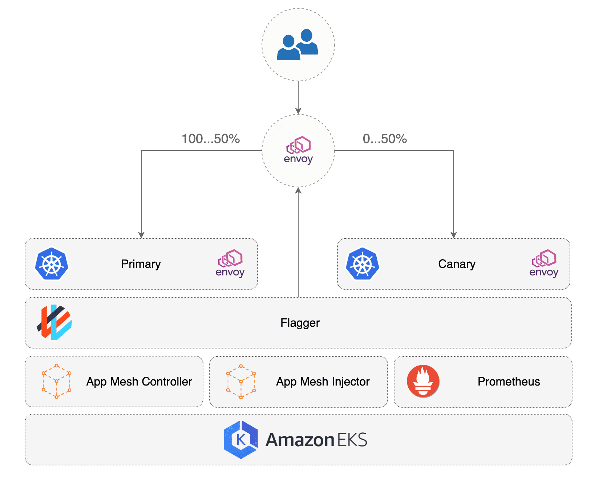

# appmesh

## Setup repo
This repo was setup using eksctl,
[git@github.com:seizadi/eksctl.git repo](https://github.com/seizadi/eksctl),
was used to create , see
[it using Weaveworks eksctl](https://eks.handson.flagger.dev/profile/#create-a-github-repository).
This is created using:
```bash
make repo
make mesh
```
The project is a demo of Weaveworks partnership with AWS to deploy a Gitops native k8s deployment
pipeline. The manifests in ./base/appmesh-system and ./base/kube-system and ./flux would be
removed and will be part of cluster orchestration as the services deployed would be used by
all applications. The cluster services that are orchestrated by the manifest are:
   * Declare CRDs used by AWS AppMesh and Weaveworks Flux and Flagger
   * Deploy Flux system including Flux Controller, Helm Operator and Memcache
   * Deploy AppMesh system including AppMesh Controller, Grafana, Prometheus and Flagger
   * Deploy Prometheus server used as Metrics Server in the cluster

We use [kustomize](https://github.com/kubernetes-sigs/kustomize) to setup the project for the pipeline
deployment:
```bash
for dir in ./flux ./base; do
  ( pushd "$dir" && kustomize create --autodetect --recursive )
done
```
To complete the kustomize setup with setup the top level yaml:
```bash
cat << EOF | tee kustomization.yaml
apiVersion: kustomize.config.k8s.io/v1beta1
kind: Kustomization
bases:
  - base
  - flux
EOF
```
The cluster we crated in
[git@github.com:seizadi/eksctl.git repo](https://github.com/seizadi/eksctl),
has a Flux controller watching this repo and we need a flux.yaml for it to know how to build
the repo: 
```bash
cat << EOF | tee .flux.yaml
version: 1
commandUpdated:
  generators:
    - command: kustomize build .
EOF
```
Verify kustomize is working before commit
```bash
kubectl apply --dry-run -k .
```
You can see the deployed manifests:
```bash
kustomize build . | more
```
When we commit this will get deployed to the cluster
```bash
$ git add .
$ git status
On branch master
Your branch is up to date with 'origin/master'.

Changes to be committed:
  (use "git reset HEAD <file>..." to unstage)

        new file:   .flux.yaml
        modified:   README.md
        new file:   base/kustomization.yaml
        new file:   flux/kustomization.yaml
        new file:   kustomization.yaml
```
Now we commit the changes and use fluxctl sync to force change
rather than wait for the poll cycle to apply:
```bash
$ git push
$ fluxctl sync --k8s-fwd-ns flux
```

## Setup canary
The 'make repo' step above lays down a sample application
[podinfo](https://github.com/stefanprodan/podinfo), which is under the base
directory, you could have a more complex application but this is a good way to
test the Flux canary provider by 
[Flagger](https://www.weave.works/oss/flagger/)
and integration with AWS AppMesh.


Here is the layout of demo app under base/demo
directory:
```bash
$ tree base/demo
base/demo
├── ingress # Envoy Proxy
│   └── appmesh-gateway.yaml
├── namespace.yaml
├── podinfo # Demo Application
│   ├── canary.yaml
│   ├── deployment.yaml
│   └── hpa.yaml
└── tester # Flagger Test Runner
    ├── deployment.yaml
    ├── service.yaml
    └── virtual-node.yaml
```
We can orchestrate the canary release using
[CRD Canary](base/demo/podinfo/canary.yaml).
[See Flagger Cannary detail description](https://eks.handson.flagger.dev/canary/#canary-custom-resource).
Flagger controls 
[Deployment](base/demo/podinfo/deployment.yaml) and
[Horizontal Pod Authoscaler (HPA)](base/demo/podinfo/hpa.yaml).
    
The initial demo application is installed with annotation so that it is
ignored by Flux this allows us to stage the overall system and also follow
lab:
```yaml
  annotations:
    fluxcd.io/ignore: "true"
```
We set this annotation in [namespace.yaml](base/demo/namespace.yaml) to
false and commit the change so that Flux will deploy it:
```bash
git add .
git commit -m "run demo"
git push
fluxctl sync --k8s-fwd-ns flux
```
